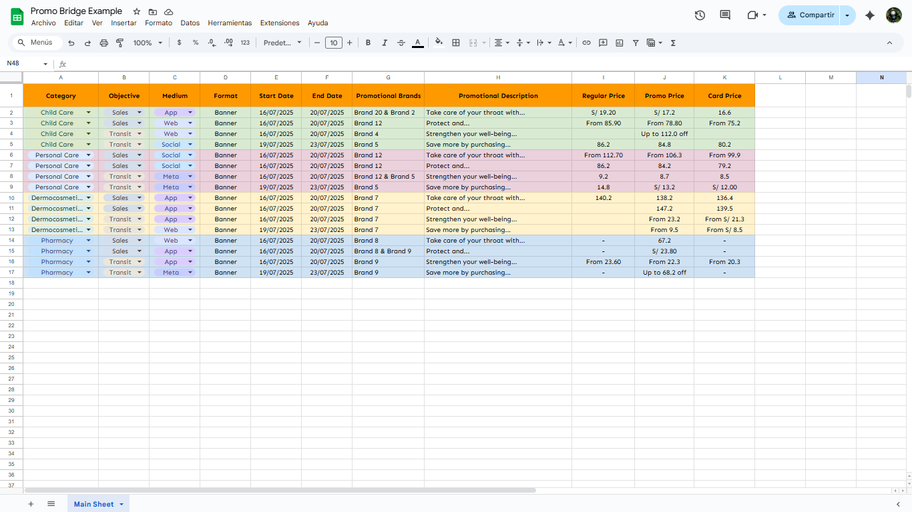
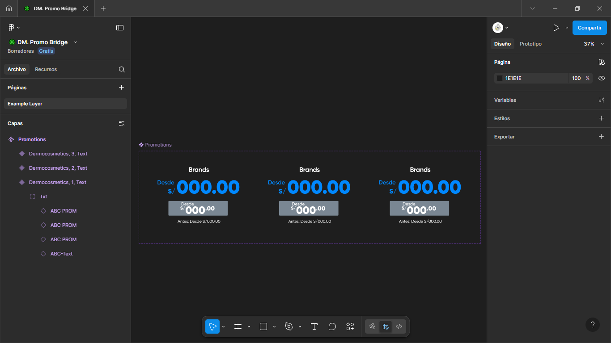
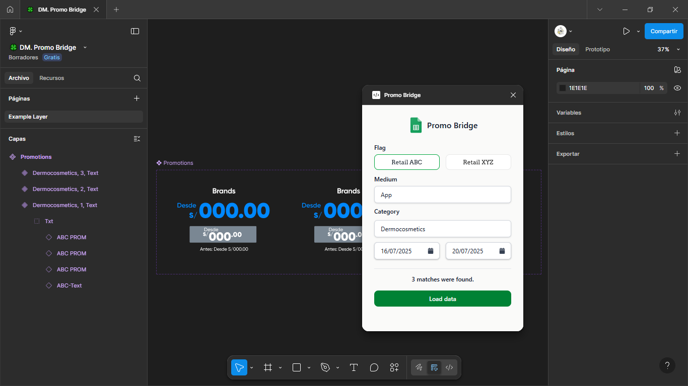
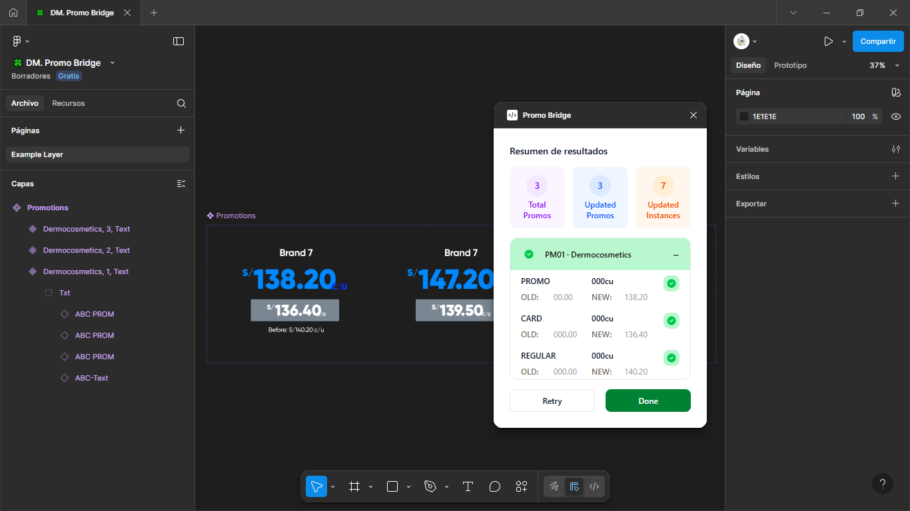

# Promo Bridge - Plugin

**Promo Bridge**  es un plugin para Figma diseñado para sincronizar datos promocionales desde Google Sheets directamente a componentes dentro de archivos de Figma. Este flujo está pensado para equipos pequeños que necesitan mantener actualizados los precios o promociones en materiales visuales sin copiar y pegar manualmente los datos.


## 🧭 Propósito

Automatizar el flujo de trabajo entre hojas de cálculo de Google Sheets y componentes en Figma, minimizando errores humanos y acelerando la generación de piezas visuales promocionales.

## 🧩 Relación con el servidor

Este plugin requiere de un servidor local que actúe como intermediario entre Figma y Google Sheets. Este servidor es responsable de:

- Leer datos desde Google Sheets mediante una cuenta de servicio.
- Procesar y estructurar los datos de acuerdo a las configuraciones predefinidas.
- Exponer los datos mediante endpoints que el plugin consume vía HTTP local.

> Repositorio del servidor: [Promo Bridge - Server](https://github.com/SDorot/promo-bridge-server) 


## 📋 Requisitos previos

Antes de ejecutar el plugin, asegúrate de contar con:

- ✅ El servidor backend corriendo localmente y correctamente configurado.
- ✅ Acceso a una hoja de Google Sheets con el formato esperado.
- ✅ Configuración de las banderas (flags) que indican qué hoja y reglas usar.
- ✅ Componentes en Figma con la estructura compatible definida por el plugin.


## 📦 Instalación 

1. Clona el repositorio.

  ```bash
  git clone https://github.com/SDorot/promo-bridge.git
  cd promo-bridge
  ```

2. Instala las dependencias.

  ```bash
  npm install
  ```

3. Compila el proyecto.

  ```bash
  npm run build
  ```

4. Carga el plugin en Figma como un plugin de desarrollo.

  - Ve a `Figma > Plugins > Development > Import from manifest`
  - Selecciona el archivo `manifest.json` ubicado en la raíz del proyecto.


## ⚙️ Configuración inicial

### 1. Definir banderas y hojas asociadas

Edita `src/shared/types.ts` para configurar los banderas disponibles (`FlagRetail`) y el mapeo hacia sus respectivos ID de hojas de cálculo de Google Sheets.

a. Define las banderas disponibles:
```ts
export type FlagRetail = 
| "flag-example"
| "flag-test";
```

b. Asocia cada bandera con el ID respectivo de la hoja de cálculo de Google Sheets.
```ts
export const FlagSheetMap = {
    "flag-example"    : "1A2B3C_SHEET_ID...",
    "flag-test"       : "7G8H9I_SHEET_ID...",
};
```

### 2. Configurar la UI

Edita `src/ui/app.tsx` para definrir la bandera por defecto e iconos visuales correspondientes en la interfaz:

a. Inicializa la bandera por defecto.
```ts
const [flag, setFlag] = useState<FlagRetail>("flag-example");
```

b. Actualiza el mapa de íconos en el componente `FlagSelector`.
```tsx
<FlagSelector
    // ...
    icons={{
        "flag-example"  : <RetailExample />,
        "flag-test"     : <RetailTest />,
        // Others flags with icons ...
    }}
/>
```


## 🗺️ Estructura esperada del archivo de Figma

El plugin navega desde cada `InstanceNode` hacia los `TextNode` que deben ser modificados. Se espera la siguiente jerarquía:

```bash
Root                            (e.g., "Current Page")
└── ComponentSetNode            (e.g., "Promotions")
    └── ComponentNode           (e.g., "Category=Dermoscosmetics, Index=3, Type=Text")
        └── InstanceNode        (e.g., "ABC PROM", "ABC-Text")
            └── GroupNode       (e.g., "Txt")
                └── TextNode    (e.g., "S/", "From", "00.00")
```
> El nombre del `ComponentNode` debe seguir este patrón: `Category={nombre_categoria}, Index={número}, Type=Text`.


## ⚙️ Configuración del Mapa de Navegación

En `src/plugin/config/navigator.ts`, se define la ruta de navegación desde la instancia (`InstanceNode`) hasta el nodo de texto (`TextNode`) que deben ser actualizado.

```ts
Regular: {
  "0cu":       [ { type: "text" } ],
  "00cu":      [ { type: "group", index: 0 }, { type: "text" } ],
  "000cu":     [ { type: "group", index: 0 }, { type: "group", index: 0 }, { type: "text" } ],
}
```

- `type: "group"`: Indica un `GroupNode` contenedor.
- `index`: Define la posición del grupo en su padre.
- `type: "text"`: Indica el nodo final objetivo donde se aplica el cambio.

> ⚠️ Verifica visualmente el orden de los nodos hijos en Figma para establecer los índices correctos.


## 🔤 Configuración de Expresiones Regulares

En `src/plugin/config/regex.ts`, se definen las expresiones para identificar nodos relevantes en función de la bandera seleccionada.

```ts
export const COMPONENT_SET_BY_FLAG = {
    "flag-example": /promotions/i,
    // ...
};

export const INSTANCE_REGEX_BY_FLAG = {
    "flag-example": /^ABC PROM/i,
    // ...
};

export const TEXT_BRAND_REGEX_BY_FLAG = {
    "flag-example": /^ABC-Text/i,
    // ...
};
```
> Puedes usar [Regex Tester](https://openreplay.com/tools/regex-tester/) para probar las expresiones regulares.


## 🧾 Configuración de Reglas

En `src/plugin/config/rules.ts`, se definen los valores posibles que se pueden asignar a las propiedades específicas de cada `InstanceNode`.

```ts
export type TemplateNewProp =
| "new"
| "value"
| "-";
```


## 🧾 Configuración de Detectores

En `src/plugin/config/resolver.ts`, se implementa la lógica para determinar el tipo de contenido en función del texto recibido.

```ts
export const NewPropResolver: RulesResolver<TemplateNewProp> = {
    detect(text: string): TemplateNewProp {
        const norm = text.trim().toLowerCase();

        const rules: Rule<TemplateNewProp>[] = [
            { test: (s) => /new/i.test(s),      resolve: () => "new" },
            { test: (s) => /value/i.test(s),    resolve: () => "value" },
        ];

        for (const rule of rules) {
            if (rule.test(norm)) return rule.resolve(norm);
        }

        return "-";
    }
};
```


## 🚩 Estrategias por Bandera

Cada bandera tiene su propia clase de estrategia en `src/plugin/strategy/`. Para después registrarlas en la lista de estrategias en el archivo `index.ts` de la misma carpeta.

```ts
const strategyMap: Record<Partial<FlagRetail>, () => FlagStrategy> = {
    "flag-example": () => new ExampleStrategy(),
    // others strategies ...
};
```


## 🧾 Aplicadores por Bandera

Cada bandera tiene su propio selector en `src/plugin/updater/`. Este selector se encarga de localizar los nodos de texto en base al tipo de promoción.

- `Promo`: Representa el precio promocional.
- `Card`: Representa el precio de tarjeta.
- `Regular`: Representa el precio regular.

Mientras que un selector escoge cuál aplicar en base a la posición de la instancia (`InstanceNode`).

```ts
switch (idx) {
    case 0: return await applyABCPromo(instance, tmplPrim, dec);
    case 1: return await applyABCCard(instance, tmplPrim, dec);
    case 2: return await applyABCRegular(instance, tmplPrim, dec);
}
```


## 🖼 Demostración

### Google Sheet


### Figma


### Jerarquía de Componentes
```bash
Promotions (ComponentSetNode)
	Dermoscosmetics, 1, Text (ComponentNode)
		Txt (GroupNode Auxiliar)
			ABC PROM (InstanceNode) : Representa el precio regular
			ABC PROM (InstanceNode) : Representa el   precio de tarjeta
			ABC PROM (InstanceNode) : Representa el precio de promocion
			ABC-Text (InstanceNode) : Contiene los elementos correspondientes a la marca y descripcion.
```


### Ejecución

1. Se rellena el formulario con los datos requeridos.
2. Se realiza una peticion a la API que nos devolverá los registros que hayan coincidido con los parametros colocados.
3. Se procede a aplicar los cambios en el archivo de Figma.
4. Se muestra un resumen de las operaciones realizadas.







## 📝 Licencia

Este proyecto está licenciado bajo los términos de la licencia MIT.  
Consulta el archivo [LICENSE](./LICENSE) para más detalles.